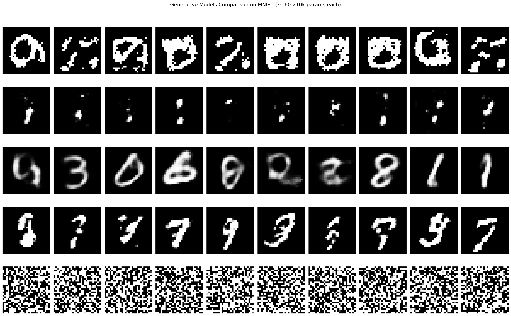

<h1 align="center">
    RBM, DBN & DNN from Scratch
</h1>

<p align="center">
    <b>Deep Learning II — Practical Work (ENSTA Paris, APM_5DS24)</b>
</p>

<p align="center">


<!-- ALL-CONTRIBUTORS-BADGE:START -->

<!-- ALL-CONTRIBUTORS-BADGE:END -->
</p>

<p align="center">


</p>

This project implements **Restricted Boltzmann Machines (RBM)**, **Deep Belief Networks (DBN)**, and **Deep Neural Networks (DNN)** entirely from scratch using NumPy. We study unsupervised pre-training via greedy layer-wise RBM training, then evaluate its impact on MNIST digit classification by comparing pre-trained vs. randomly initialized DNNs across multiple experimental axes.

<p align="center">
  
</p>

## :dart: Overview

The project addresses four main questions:

1. **RBM** — Can we learn useful features from Binary AlphaDigits using Contrastive Divergence and generate images via Gibbs sampling?
2. **DBN** — Does greedy layer-wise stacking of RBMs improve generative quality?
3. **DNN Classification** — Does unsupervised pre-training (RBM) improve supervised classification on MNIST compared to random initialization?
4. **Bonus** — How do classical generative models (RBM, DBN) compare to modern approaches (VAE, GAN, DDPM) at similar parameter budgets (~160k)?

## :package: Project Structure

```text
APM_5DS24_TP---Deep-Learning-II/
├── README.md
├── requirements.txt
├── report/
│   ├── magalhaes_yang-TP-DNN.pdf         # Final report
│   └── TP_DNN.pdf                   # Assignment description
├── src/                             # Source modules (pure NumPy)
│   ├── __init__.py
│   ├── rbm.py                       # RBM: init, CD-1 training, Gibbs sampling
│   ├── dbn.py                       # DBN: greedy layer-wise training, generation
│   ├── dnn.py                       # DNN: pre-training, backprop, softmax
│   └── utils.py                     # Data loading (AlphaDigits + MNIST)
├── experiments/                     # Runnable scripts
│   ├── principal_RBM_alpha.py       # RBM on Binary AlphaDigits
│   ├── principal_DBN_alpha.py       # DBN on Binary AlphaDigits
│   ├── principal_DNN_MNIST.py       # MNIST: pre-trained vs random (3 figures)
│   ├── principal_best_model.py      # Best config + softmax visualization
│   └── principal_bonus.py           # Bonus: generative comparison (local)
├── notebooks/
│   └── bonus_comparison.ipynb       # Bonus: RBM vs DBN vs VAE vs GAN vs DDPM
├── images/                          # Generated figures
└── data/                            # Datasets (not in repo)
```

## :wrench: Implemented Methods

### Core (NumPy from scratch)

| Module | Method | Description |
| ------ | ------ | ----------- |
| `rbm.py` | **RBM** | Contrastive Divergence-1 training, Gibbs sampling generation |
| `dbn.py` | **DBN** | Greedy layer-wise RBM stacking, top-down generation |
| `dnn.py` | **DNN** | RBM pre-training + backpropagation, softmax output, cross-entropy loss |

### Bonus (PyTorch)

| Model | Architecture | Params |
| ----- | ------------ | ------ |
| **VAE** | 784 → 100 → 10 (latent) → 100 → 784 | ~161k |
| **GAN** | G: 64 → 128 → 784 / D: 784 → 128 → 1 | ~210k |
| **DDPM** | 784 + t_emb → 100 → 100 → 784 (T=500) | ~169k |

## :gear: Training Configuration

| Parameter | RBM / DBN | DNN (backprop) | Bonus models |
| --------- | --------- | -------------- | ------------ |
| Epochs | 100 | 200 | 200–300 |
| Learning rate | 0.1 | 0.1 | 1e-3 / 2e-4 |
| Batch size | 128 | 128 | 128 |
| Optimizer | SGD (manual) | SGD (manual) | Adam |
| Hardware | CPU | CPU | Google Colab (GPU) |

## :bar_chart: Results

### Best DNN Configuration

Based on three experimental axes (number of layers, neurons per layer, training samples):

| Parameter | Best value | Justification |
| --------- | ---------- | ------------- |
| Hidden layers | 2 | No benefit from deeper networks (Fig 1) |
| Neurons per layer | 700 | Best error rate for pre-trained DNN (Fig 2) |
| Training samples | 60,000 (all) | Maximizes performance (Fig 3) |
| Initialization | Pre-trained (RBM) | Consistently better or equal to random |

**Best model: `[784, 700, 700, 10]` — Test error: ~2.6%**

### Pre-trained vs Random Initialization

| Experiment | Key finding |
| ---------- | ----------- |
| **Varying layers** (2–5, 200 neurons) | Pre-training essential for >3 layers; both similar at 2 layers |
| **Varying neurons** (100–700, 2 layers) | Pre-trained improves with more neurons; random plateaus at ~2.8% |
| **Varying samples** (1k–60k) | Pre-training helps most with limited data; both converge at 60k |

### Generated Figures

| Experiment | Figures |
| ---------- | ------- |
| RBM on AlphaDigits | `rbm_alpha_q{50,100,200,300}.png` — varying hidden units |
| RBM character sets | `rbm_alpha_nchars{3,10,36}.png` |
| DBN on AlphaDigits | `dbn_alpha_{1layer,2layers,3layers}.png` |
| DBN character sets | `dbn_alpha_nchars{5,10,36}.png` |
| DNN on MNIST | `fig1_layers.png`, `fig2_neurons.png`, `fig3_samples.png` |
| Best model | `softmax_best_model.png` |
| Bonus | `bonus_comparison.png` — RBM vs DBN vs VAE vs GAN vs DDPM |

## :floppy_disk: Datasets

| Dataset | Role | Format | Size |
| ------- | ---- | ------ | ---- |
| Binary AlphaDigits | Generative experiments | 20x16 binary images, 36 chars x 39 samples | `binaryalphadigs.mat` |
| MNIST | Classification | 28x28 binarized images, 10 digits | 60k train / 10k test |

## :rocket: Usage

### Cloning the repository

```bash
git clone https://github.com/sergio-contente/APM_5DS24_TP---Deep-Learning-II.git
cd APM_5DS24_TP---Deep-Learning-II
```

### Requirements

```bash
pip install -r requirements.txt
```

### Data setup

The datasets are **not included** in the repository. You must manually place them in the `data/` folder:

```text
data/
├── binaryalphadigs.mat              # Binary AlphaDigits (.mat file)
└── Fichiers MNIST-20260320/         # Unzipped MNIST folder
    ├── train-images-idx3-ubyte
    ├── train-labels-idx1-ubyte
    ├── t10k-images-idx3-ubyte
    └── t10k-labels-idx1-ubyte
```

1. Place `binaryalphadigs.mat` directly inside `data/`
2. Unzip the MNIST archive into `data/Fichiers MNIST-20260320/` (keep the 4 raw IDX files at the top level of that folder)

### Running experiments

```bash
# RBM on Binary AlphaDigits (image generation)
python experiments/principal_RBM_alpha.py

# DBN on Binary AlphaDigits (image generation)
python experiments/principal_DBN_alpha.py

# MNIST study: pre-trained vs random init (generates 3 figures)
python experiments/principal_DNN_MNIST.py

# Best model with softmax visualization
python experiments/principal_best_model.py
```

### Bonus — Generative models comparison

```bash
# Local (requires GPU for reasonable speed)
python experiments/principal_bonus.py
```

Or open `notebooks/bonus_comparison.ipynb` in **Google Colab** (recommended for GPU access) and run all cells.

## :page_facing_up: Report

The full project report is available at [`report/magalhaes_yang-TP-DNN.pdf`](report/magalhaes_yang-TP-DNN.pdf). It covers:

- Detailed analysis of RBMs on Binary AlphaDigits (varying hidden units and character diversity)
- DBN study for image generation (impact of depth and data diversity)
- Systematic comparison between pre-trained and randomly initialized DNNs on MNIST across three axes: depth, width, and training set size
- Bonus comparison of five generative models (RBM, DBN, VAE, GAN, DDPM)

> The original assignment is available at [`report/TP_DNN.pdf`](report/TP_DNN.pdf).

## :books: References

- Hinton, G. E. (2002). *Training Products of Experts by Minimizing Contrastive Divergence*. Neural Computation.
- Hinton, G. E., Osindero, S., & Teh, Y. W. (2006). *A Fast Learning Algorithm for Deep Belief Nets*. Neural Computation.
- Erhan, D., Bengio, Y., et al. (2010). *Why Does Unsupervised Pre-training Help Deep Learning?*. JMLR.
- Kingma, D. P. & Welling, M. (2014). *Auto-Encoding Variational Bayes*. ICLR.
- Goodfellow, I. et al. (2014). *Generative Adversarial Nets*. NeurIPS.
- Ho, J., Jain, A., & Abbeel, P. (2020). *Denoising Diffusion Probabilistic Models*. NeurIPS.

## :busts_in_silhouette: Contributors

<table>
  <tr>
    <td align="center">
      <a href="https://github.com/sergio-contente">
        <br/>
        <sub><b>Sergio Magalhaes Contente</b></sub>
      </a><br/>
      <a href="https://github.com/sergio-contente/APM_5DS24_TP---Deep-Learning-II/commits?author=sergio-contente" title="Code">💻</a>
      <a href="#" title="Documentation">📖</a>
    </td>
    <td align="center">
      <a href="https://github.com/MiaYoung2023">
        <br/>
        <sub><b>Chenxi Yang</b></sub>
      </a><br/>
      <a href="https://github.com/sergio-contente/APM_5DS24_TP---Deep-Learning-II/commits?author=MiaYoung2023" title="Code">💻</a>
      <a href="#" title="Documentation">📖</a>
    </td>
  </tr>
</table>
